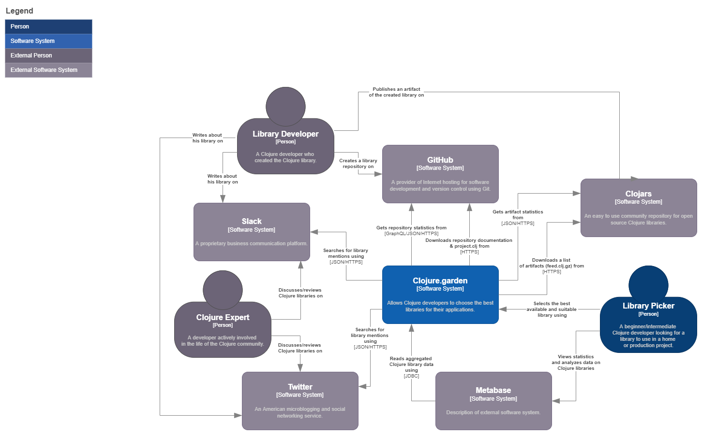
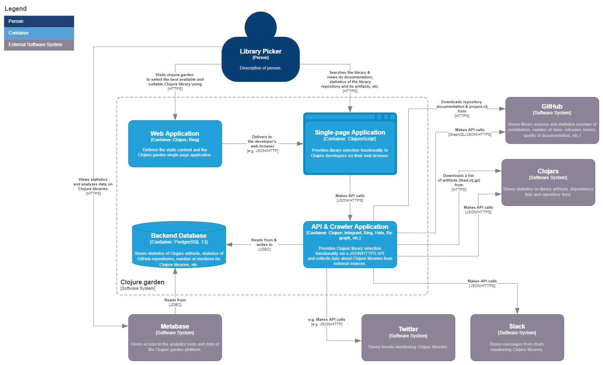
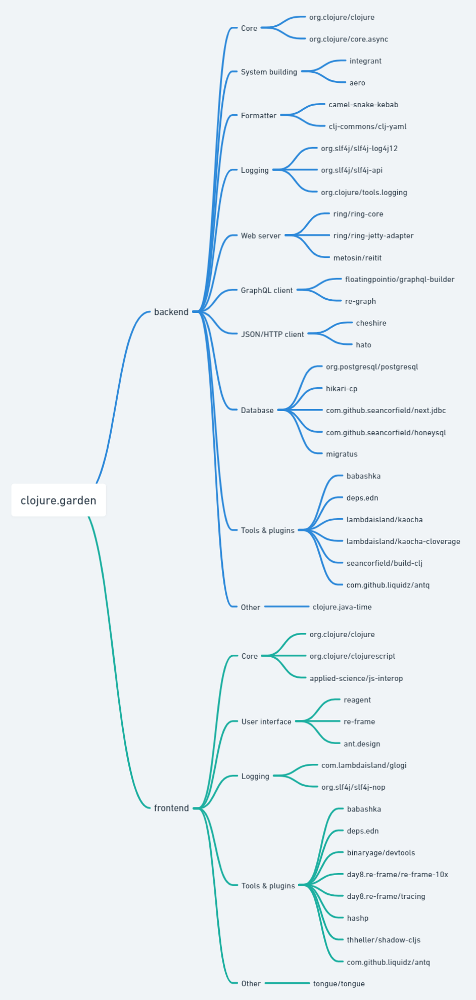
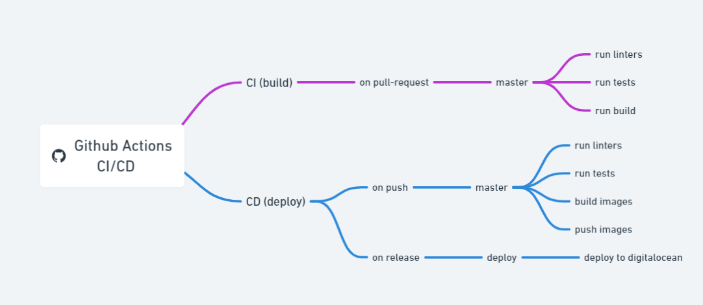

## Clojure Garden

  

  

The [navigator](https://clojure.garden) in the Clojure ecosystem: start quickly with the Clojure development

\#clojure \#clojurescript

## Introduction

> I want it to become a Google for Clojure libraries
> 
> -- <cite>Artem Barmin, Clojure Garden creator</cite>

**clojure.garden** is a content curation platform intended to be used within the Clojure ecosystem to find the best practices 
for your case easily and quickly.

It helps figure out the Clojure ecosystem much easier without wasting time
while reading libs updates and going into context.

## Prehistory

During 2020-21 years we’ve conducted several surveys and gathered a number of insights from Clojure developers. We collected and 
analyzed practitioners' opinions about Clojure's benefits and issues for understanding community challenges.

One of the most common pain points was the ‘multitude of libraries/tooling’ that results in wasting time while choosing the right 
tool and reading updates. So the main idea was to find a way to improve Clojure ergonomics and remove such friction points as 
wasting time on library choosing and decision-making about what architecture to use.

## Actual problems we try to deal with

> Only by removing friction points in a developer’s Customer journey   
> map we can make Clojure more popular  
-- <cite>Freshcode team</cite>

Usually, developers need to check around 10 resources (Slack, GitHub, Twitter, Reddit, Clojure Deref, Stack Overflow, etc) to 
decide what library to choose. And there is still no solution for convenient data storage that allows quick and simple analysis. 
The path from search to choosing libs is extremely complicated and resource-intensive.

So, the main 'enemies' we are going to fight with are so-called friction points during the Clojure developer journey map.

Among the negative factors influencing the developer's journey map, we consider the following:

- Insufficient context level of libs usage
- System's fragmentation due to many influencers
- Lack of a unified knowledge base
- Data is provided in streaming form

## Priority goals

- Creating a **unified knowledge base**
- Moving from stream-based information feeds to the **structured  
  comprehensive system of navigation** (Data Fluidity VS Accumulation)
- Solving problem of choosing libraries, decision making, searching, and benchmarking

## Long-term goals

- Introduce an **“observability standard”** for the Clojure ecosystem
- Transforming clojure.garden into **a focal point** within the language ecosystem
- Increasing **Clojure awareness**
- Improving **learning curve** that newcomers must undergo

## Primary target audience

Sure, clojure.garden will come in handy for a wide range of users, but the main  
segments whose needs we want to cover are:

- newcomers
- developers who start their first pet project and are not active community members

We want to fast-track the Clojure onboarding process and make it enjoyable and seamless.

## Tech ideas to realize:

* Create a database that will make it easier to find so-called social signals about each Clojure library and all  
  contextual information regarding it (case uses, mentions on forums, etc.):
* Introduce LibRank ranking system based on social mentions and open-source/closed-source project.clj’s
* Implement the metric “Clojure Ecosystem Health Score”:
  - Create a “template” for documentation that will help authors to prepare docs easier and better
  - Outreach library authors to write documentation according to our standards
  - Provide human resources(developers and tech writers) for helping authors with documentation
  - Collect project.clj stats across industry
* Create a mechanism for crowdsourcing info based on Slack/GitHub:
  - Allow submitting anonymous data for improving LibRank data quality
  - Allow improving library docs and examples by encouraging community members to fulfill predefined template

## Libs’ Criteria for Evaluation

## Triad of main clojure.garden concepts

- clarity
- ease of navigation
- reduction of entropy

## Quickstart

### System architecture

<strong><em>clojure.garden context</em></strong>
  

<strong><em>clojure.garden container</em></strong>

### Dependencies

<strong><em>clojure.garden dependencies</em></strong>
  

### Deployment

<strong><em>Repository CI/CD</em></strong>
 

### Roadmap

- [x] Bootstrap the project & the backend module
- [x] **\[devops\]** Configure local deployment
- [x] **\[backend\]** Create a GitHub API client to collect starts, number of contributors,  
      issues, releases, etc.
- [x] **\[backend\]** Create a Clojars API client to collect the artifacts data
- [x] **\[backend\]** Create the ER diagram for the backend database
- [x] **\[backend\]** Write database migrations
- [x] **\[backend\]** Create a feed crawler for Clojars
- [x] **\[devops\]** Setup Metabase
- [x] Create basic charts in Metabase
- [x] **\[backend\]** Migrate to deps.edn
- [x] Write a good README
- [x] **\[devops\]** Configure GitHub actions
- [x] **\[frontend\]** Bootstrap the project frontend module
- [ ] **\[backend\]** Create a Slack API client to collect Clojure library mention context
- [x] **\[backend\]** Create a Twitter API client to collect Clojure library mention context
- [ ] **\[backend\]** Create an orchestrator for the data loading modules
- [ ] **\[backend\]** **\[frontend\]** Create custom library grouping by tags
- [ ] **\[frontend\]** Create basic charts and tables
- [ ] **\[frontend\]** **\[backend\]** Implement library search
- [ ] **\[backend\]** **\[frontend\]** Implement of custom library ratings
- [ ] **\[backend\]** **\[frontend\]** implement a personal account with the ability to create your own charts and subscriptions

### Contributing

Please see the [contributing guide](CONTRIBUTING.md).

## Clojure Garden Fellowship

See a list of companies and individual developers using clojure.garden.
Are you using clojure.garden in your company or personal projects? Let us know [here](https://freshcodeit.com/contact).

## Talk

An overview of Сlojure Garden concepts on [re:Clojure 2021](https://www.reclojure.org/) presentation:

https://youtu.be/bzSJ0EKLUZg

## Core team

[Artem Barmin](https://github.com/artem-barmin) \
[Inna Kovalenko](https://github.com/innakovalenko) \
[Anastasia Gretchenko](https://github.com/Agretchenko) \
[Ilshat Sultanov](https://github.com/just-sultanov) \
[Gleb Yeliseev](https://github.com/devleifr) \
[Volodymyr Pavliuk](https://github.com/volodymyrpavliuk)

## Copyright & License

The MIT License (MIT)

Copyright © 2021-2022 Freshcode LTD
